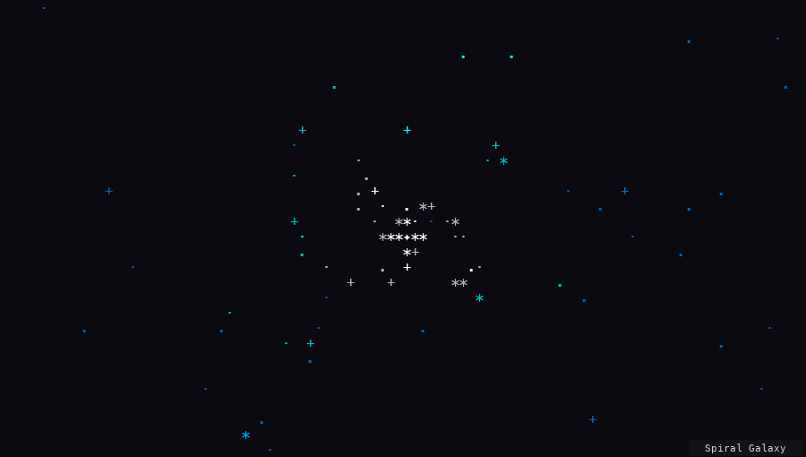
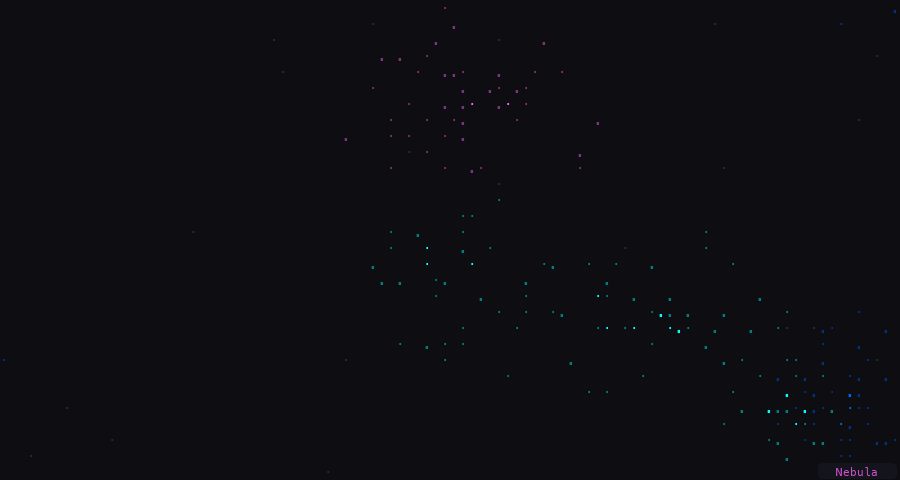
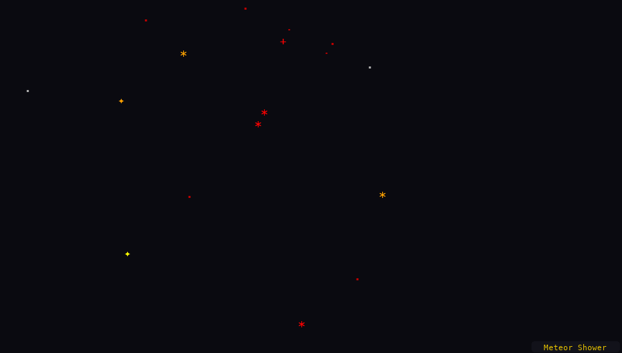
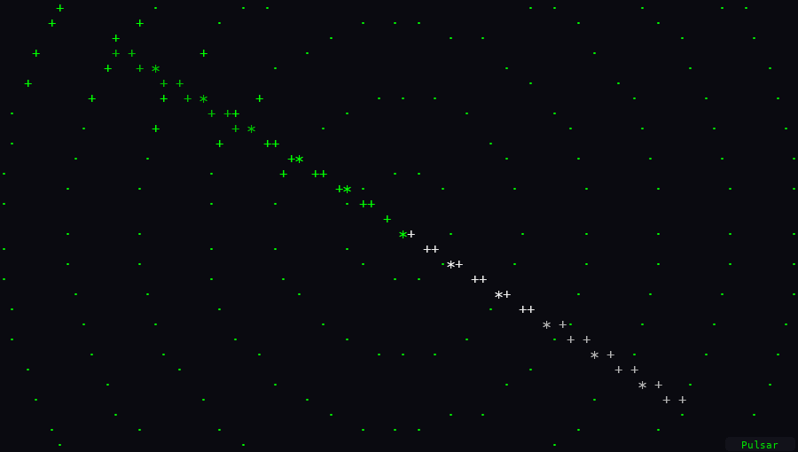
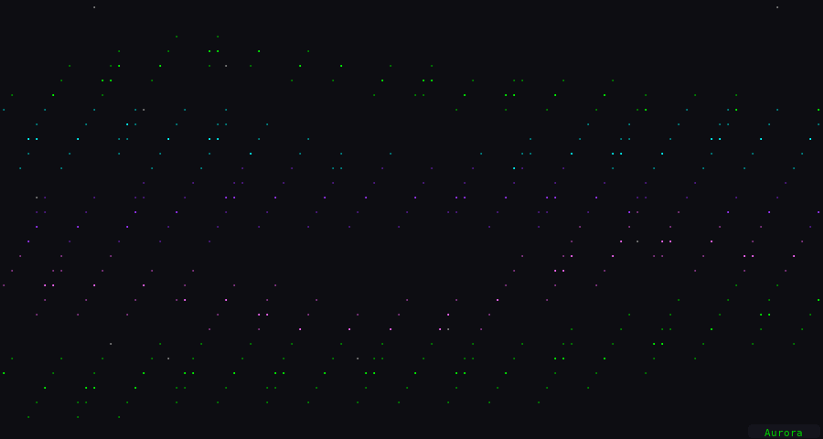
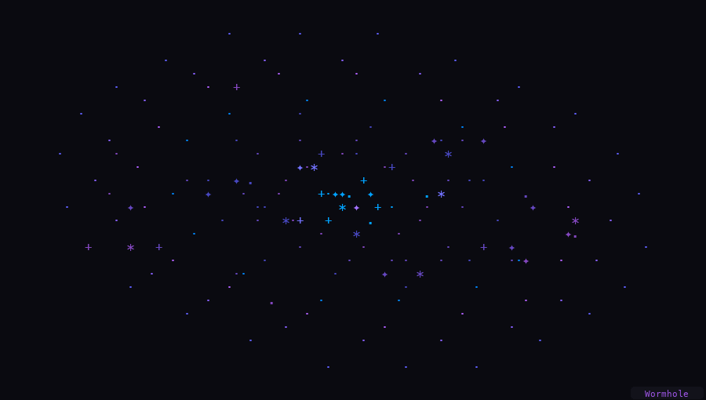

<p align="center">
  <h1 align="center">✦ stardust</h1>
  <p align="center">
    <strong>Animated terminal overlay for Claude Code</strong>
  </p>
  <p align="center">
    When you switch away from your terminal tab, stardust takes over with a mesmerizing space animation.<br>
    Switch back and everything is exactly where you left it.
  </p>
  <p align="center">
    <a href="#install"></a>
    
    
    
  </p>
</p>

<br>

<p align="center">
  
</p>

<br>

## Features

- **6 unique animations** — Spiral Galaxy, Nebula, Meteor Shower, Pulsar, Aurora, Wormhole
- **Focus detection** — activates when the terminal tab loses focus, deactivates on return
- **Activity detection** — reads Claude's conversation JSONL to show what it's currently doing
- **Fade-in transitions** — elements appear spatially distributed over 300ms
- **Tab title** — sets your terminal tab title to show the current task
- **Alternate screen buffer** — original terminal content is fully preserved
- **Pick your animation** — `--animation pulsar` or press `n` to cycle while active
- **Zero dependencies** — pure Python 3, no pip install needed

## Install

**Quick install:**

```sh
curl -fsSL https://raw.githubusercontent.com/vgutgutia/stardust/main/install.sh | bash
```

**Manual install:**

```sh
git clone https://github.com/vgutgutia/stardust.git
cd stardust
chmod +x stardust
cp stardust ~/.local/bin/
```

Make sure `~/.local/bin` is in your `PATH`.

## Usage

```sh
# Run claude with animations
stardust

# Pass a task description
stardust "fix the login bug"

# Pick a specific animation
stardust -a pulsar "build the API"

# Wrap a custom command
stardust "refactor auth" -- claude --dangerously-skip-permissions

# Use a different model
stardust "write tests" -- claude --model sonnet

# List available animations
stardust --list
```

Everything before `--` is the task description. Everything after `--` is the command to run (defaults to `claude`).

While the overlay is active, press **n** to cycle to the next animation.

## Animations

A random animation is selected each time, or pick one with `stardust -a <name>`.

<table>
<tr>
<td align="center"><strong>Spiral Galaxy</strong><br></td>
<td align="center"><strong>Nebula</strong><br></td>
</tr>
<tr>
<td align="center"><strong>Meteor Shower</strong><br></td>
<td align="center"><strong>Pulsar</strong><br></td>
</tr>
<tr>
<td align="center"><strong>Aurora</strong><br></td>
<td align="center"><strong>Wormhole</strong><br></td>
</tr>
</table>

## How It Works

1. Forks a child process inside a **PTY** (pseudo-terminal)
2. Enables **focus reporting** (`\033[?1004h`) — the terminal sends `\033[I` / `\033[O` on focus changes
3. On focus-out, switches to the **alternate screen buffer** (`\033[?1049h`) and renders animations at ~30fps
4. On focus-in, restores the original screen — any output produced while away is replayed
5. Forwards `SIGWINCH` to the child so terminal resizes work seamlessly

## Requirements

- macOS (or any terminal that supports focus reporting)
- Python 3.6+
- [Claude Code](https://docs.anthropic.com/en/docs/claude-code) (or any CLI tool you want to wrap)

## License

MIT — [Vansh Gutgutia](https://github.com/vgutgutia)
